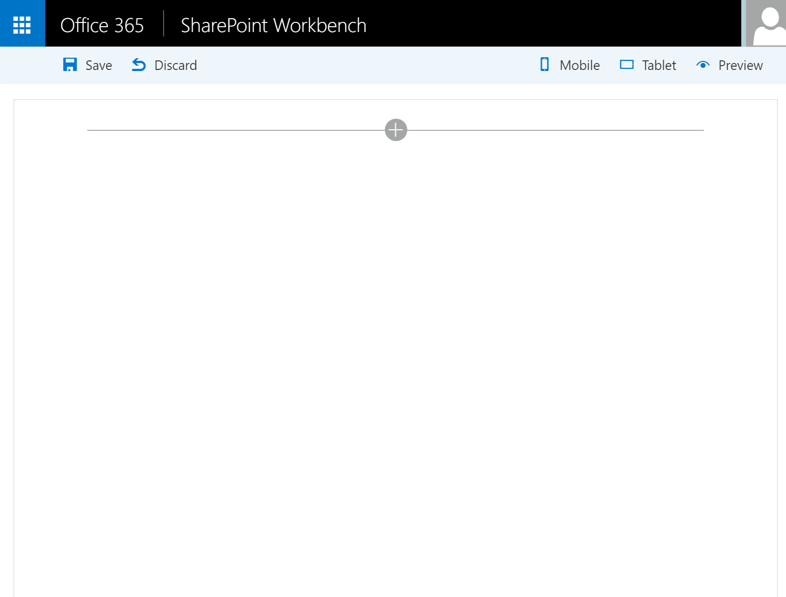

## SPFx custom fields samples

> Note: The SharePoint Framework is currently in preview and is subject to change. SharePoint Framework client-side web parts are not currently supported for use in production enviornments.

These samples show how to implement custom fields with the new SharePoint Framework (SPFx). This samples
includes for example an implementation of PropertyFieldDatePicker control based on the Office UI Fabric DatePicker component.

## PropertyFieldDatePicker control

This sample shows how to include a DatePicker custom field in your new client side web part for SPFx:



### How to use this custom field in your project

To use this custom field in your solution, follow these steps :

1) Include in your solution the /controls directory with the <addr>PropertyFieldDatePicker.ts</addr> and PropertyFieldDatePickerHost.tsx files

2) In you web part file (for example MyWebPart.ts), import the custom field:
```javascript
import { PropertyFieldDatePicker } from './controls/PropertyFieldDatePicker';
```

3) In your web part constructor, bind the onPropertyChange method:
```javascript
this.onPropertyChange = this.onPropertyChange.bind(this);
```
4) Create a new property for your web part normally of type string. For this example, the property is called 'date'

5) Add a PropertyFieldDatePicker in your Web Part properties to map on this property:
```javascript
protected get propertyPaneSettings(): IPropertyPaneSettings {
    return {
      pages: [
        {
          header: {
            description: strings.PropertyPaneDescription
          },
          groups: [
            {
              groupName: strings.BasicGroupName,
              groupFields: [
                PropertyPaneTextField('description', {
                  label: strings.DescriptionFieldLabel
                }),
                PropertyFieldDatePicker('date', {
                  label: strings.DateFieldLabel,
                  initialDate: this.properties.date,
                  onPropertyChange: this.onPropertyChange
                })
              ]
            }
          ]
        }
      ]
    };
```
6) Add the PropertyFieldDatePicker labels to your localisation files. This is to add to your solution the
localised labels for months, days, etc. To do that include the labels definitions to your files called
src/webparts/yourwebpart/loc/mystrings.d.ts and src/webparts/yourwebpart/loc/en-us.js (or any other langage).
You can find the complete list of labels to add in the sample files
[mystrings.d.ts](./src/webparts/customFieldsWebPart/loc/mystrings.d.ts) and
[en-us.js](./src/webparts/customFieldsWebPart/loc/en-us.js) of this sample.


### About the PropertyFieldDatePicker properties

With the PropertyFieldDatePicker you can define the following properties:
* **label** (mandatory): Defines the label displayed on top of the DatePicker control
* **initialDate** (optional): Defines the default value of the control. You should use the value of the mapped property of the WP property bag
* **onPropertyChange** (mandatory): Sets the function of the WP to raise when the property's value changed. You must map with the onPropertyChange method of your web part object
* **formatDate** (optional): Sets a method used to format as you want your date property (see the sample bellow)

If you want to define a specific Date format, you can define the formatDate function as follow:

```javascript
  private formatDateIso(date: Date): string {
    return date.toISOString();
  }

  protected get propertyPaneSettings(): IPropertyPaneSettings {
    return {
      pages: [
        {
          header: {
            description: strings.PropertyPaneDescription
          },
          groups: [
            {
              groupName: strings.BasicGroupName,
              groupFields: [
                PropertyFieldDatePicker('date2', {
                  label: strings.DateFieldLabel,
                  initialDate: this.properties.date2,
                  formatDate: this.formatDateIso,
                  onPropertyChange: this.onPropertyChange
                })
              ]
            }
          ]
        }
      ]
    };
```

## Build and run this sample in the SharePoint workbench

```bash
git clone the repo
npm i
tsd install
gulp serve
```

If you need more information about to develop SharePoint Framework client side web part, deploy and test it on your workbench
station, you can consult the following tutorial: https://github.com/SharePoint/sp-dev-docs/wiki/Setup-SharePoint-Tenant

## known limitations

This custom fields has the following limitations :
* In Non-Reactive mode, the 'Apply' button of the web part properties is not automatically enabled when you're selecting a new date
* This component only manage date and not the time also

##The MIT License (MIT)

Copyright (c) 2016 Olivier Carpentier

Permission is hereby granted, free of charge, to any person obtaining a copy of this software and associated documentation files (the "Software"), to deal in the Software without restriction, including without limitation the rights to use, copy, modify, merge, publish, distribute, sublicense, and/or sell copies of the Software, and to permit persons to whom the Software is furnished to do so, subject to the following conditions:

The above copyright notice and this permission notice shall be included in all copies or substantial portions of the Software.

THE SOFTWARE IS PROVIDED "AS IS", WITHOUT WARRANTY OF ANY KIND, EXPRESS OR IMPLIED, INCLUDING BUT NOT LIMITED TO THE WARRANTIES OF MERCHANTABILITY, FITNESS FOR A PARTICULAR PURPOSE AND NONINFRINGEMENT. IN NO EVENT SHALL THE AUTHORS OR COPYRIGHT HOLDERS BE LIABLE FOR ANY CLAIM, DAMAGES OR OTHER LIABILITY, WHETHER IN AN ACTION OF CONTRACT, TORT OR OTHERWISE, ARISING FROM, OUT OF OR IN CONNECTION WITH THE SOFTWARE OR THE USE OR OTHER DEALINGS IN THE SOFTWARE.
